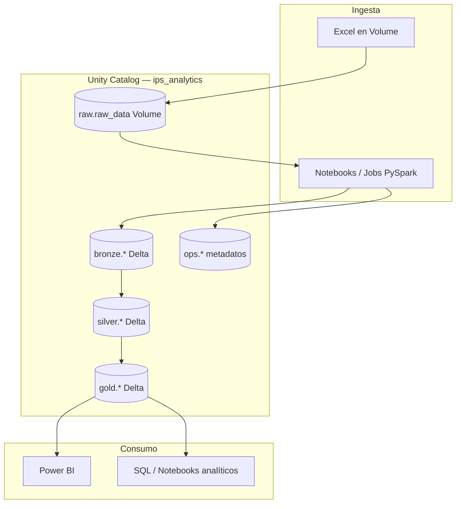
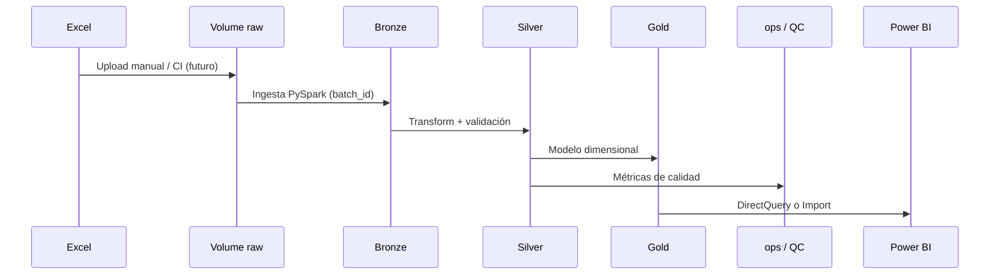
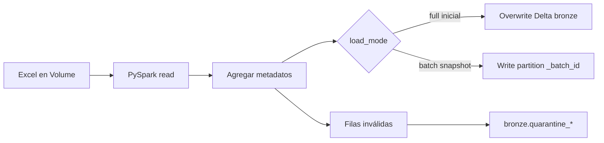
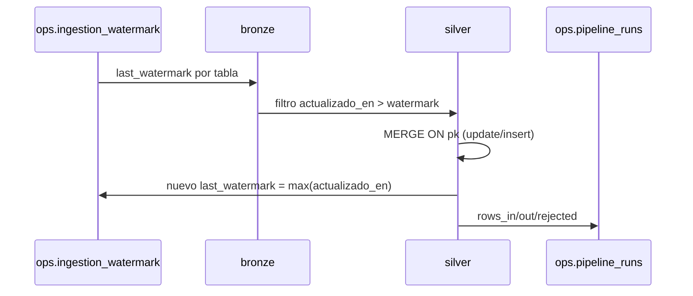

# Arquitectura de la solución IPS Analytics

Diseño end-to-end alineado con la prueba técnica: ingesta, almacenamiento lakehouse, procesamiento por capas, consumo BI, calidad, seguridad y monitoreo. Implementación objetivo: **Databricks Free Edition** + **PySpark/SQL** + **Git** + **Power BI**.

---

## 1. Vista general



**Principio:** separación de responsabilidades por capa medallión; cada capa es reprocesable desde la anterior.

---

## 2. Capas medallión

### 2.1 Raw (landing)

| Aspecto | Decisión |
|---------|----------|
| **Ubicación** | Volume `ips_analytics.raw.raw_data` |
| **Formato** | Excel fuente sin transformar |
| **Propósito** | Punto de entrega de archivos; auditoría de lo recibido |
| **Retención** | Mantener snapshot por `_batch_id` en Bronze; archivos en Volume según política del workspace |

### 2.2 Bronze

| Aspecto | Decisión |
|---------|----------|
| **Ubicación** | Tablas Delta `ips_analytics.bronze.{pacientes,citas,eventos_clinicos,facturacion}` |
| **Contenido** | Columnas fuente + metadatos técnicos |
| **Tipos** | Preferencia por preservar strings desde Excel; evitar pérdida de información en primera carga |
| **Metadatos** | `_ingested_at`, `_source_file`, `_batch_id`, opcional `_row_hash` |
| **Idempotencia** | Full overwrite por batch en carga inicial; evolución a `MERGE` por PK + batch (Fase 2+) |
| **Errores** | Filas ilegibles → quarantine o tabla `bronze_quarantine_*` |

**Justificación:** Bronze permite reprocesar Silver/Gold sin volver a leer Excel manualmente y deja trazabilidad para defensa y auditoría.

### 2.3 Silver

| Aspecto | Decisión |
|---------|----------|
| **Ubicación** | `ips_analytics.silver.*` Delta |
| **Transformaciones** | Limpieza, casts, normalización de dominios, deduplicación por PK, validación referencial |
| **Salidas auxiliares** | Registros rechazados documentados (`silver_rejects` o flags) |
| **PII** | Datos identificables presentes pero aún no orientados a BI; preparar enmascarado downstream |

**Justificación:** Capa de **confianza** para joins entre citas, eventos y facturación; concentra reglas de calidad reproducibles.

### 2.4 Gold

| Aspecto | Decisión |
|---------|----------|
| **Ubicación** | `ips_analytics.gold.*` |
| **Modelo** | Estrella: dimensiones (`dim_paciente`, `dim_tiempo`, …) y hechos (`fact_citas`, `fact_eventos_clinicos`, `fact_facturacion`) |
| **Consumo** | Vistas KPI agregadas para Power BI |
| **PII** | Exposición a analistas con documento enmascarado o hash; sin columnas innecesarias en vistas públicas |

**Justificación:** Simplifica BI y SQL de negocio; desacopla cambios de limpieza (Silver) de cambios de reporting.

---

## 3. Flujo de datos (batch)



Detalle de ingesta e incrementalidad: **§11**.

---

## 4. Componentes tecnológicos

| Componente | Rol |
|------------|-----|
| **Databricks Repos** | Versionado Git ↔ notebooks y código |
| **Unity Catalog** | Gobierno, linaje, permisos por esquema |
| **Delta Lake** | ACID, time travel, reprocesos |
| **PySpark** | Ingesta y transformaciones complejas |
| **SQL** | DDL, vistas Gold, consultas ad hoc |
| **Power BI** | Dashboard y KPIs |
| **GitHub Actions** | CI: tests y lint (Fase 7); CD documentado |

---

## 5. Seguridad y PII

| Riesgo | Mitigación |
|--------|------------|
| PII en Git | `.gitignore` para `*.xlsx`; datos solo en Volume |
| Acceso excesivo | UC: ingeniería escribe Bronze–Silver; analistas leen Gold |
| Documento / nombres | **Fase 4:** `gold.dim_paciente` solo expone `numero_documento_hash` (SHA-256); nombres/apellidos no se materializan en Gold |
| Consumo Power BI | Usar vista **`gold.dim_paciente_bi`** (sin PII en claro); permisos UC de lectura solo sobre `gold` |
| Silver | PII completa restringida a rol ingeniería (`silver.pacientes`) |
| Secrets | Tokens en Databricks secrets / GitHub Secrets, nunca en notebooks |
| Auditoría | `_ingested_at`, `_batch_id`, tabla `ops.pipeline_runs` (Fase 5) |

**Campos sensibles:** `numero_documento`, `nombres`, `apellidos` (permanecen en Silver; no en vistas BI).

---

## 6. Calidad y monitoreo

| Fase | Mecanismo |
|------|-----------|
| Exploración (0) | Perfilado manual — baseline en `docs/supuestos.md` |
| Silver/Gold | Reglas declaradas en `docs/calidad_datos.md` (Fase 1) |
| Automatización | Notebook `04_data_quality` + tests Python (Fase 5) |
| Monitoreo | Conteos por capa, % rejects, alertas en Job fallido (Databricks) |

**KPIs de calidad de pipeline (ops):** filas ingeridas vs rechazadas, duración de job, último watermark.

---

## 7. Entorno Free Edition — consideraciones

- Recursos limitados: jobs secuenciales Bronze → Silver → Gold; evitar shuffles innecesarios en datasets pequeños.
- Catálogo: si `CREATE CATALOG ips_analytics` no está permitido, usar catálogo proporcionado (`workspace` / `main`) manteniendo **misma estructura de esquemas** (`bronze`, `silver`, `gold`, `raw`, `ops`).
- Volume: ruta típica `/Volumes/<catalog>/raw/raw_data/`.
- Power BI: Import mode aceptable por volumen actual (~4k filas hechas); escalar a DirectQuery + SQL Warehouse en producción.

---

## 8. Evolución a producción (Azure / Databricks)

| Tema | Evolución |
|------|-----------|
| **Ingesta** | Auto Loader desde ADLS, Event Grid, o Fivetran |
| **Orquestación** | Databricks Workflows, dependencias, reintentos |
| **CI/CD** | Bundle (DAB) o Terraform + deploy de Jobs y DDL |
| **Calidad** | Databricks Lakehouse Monitoring, Great Expectations en Jobs |
| **Costos** | Jobs serverless vs classic, OPTIMIZE/VACUUM programados, partición por fecha |
| **Alta disponibilidad** | Multi-AZ storage, réplica de catálogo |
| **Escenarios enunciado** | Volumen ↑ (particionar), tardíos (watermark + late merge), DELETE (soft delete / SCD2), schema drift (Evolution Delta + contratos), fallo pipeline (idempotencia batch), costos (políticas cluster), PII (column masking UC) |

---

## 9. Alternativas consideradas

| Alternativa | Por qué no es la principal en esta prueba |
|-------------|------------------------------------------|
| DW relacional puro (Synapse/Snowflake only) | El enunciado privilegia Databricks + PySpark lakehouse |
| Bronze omitido (Excel → Silver directo) | Pierde trazabilidad e idempotencia exigidas conceptualmente |
| Solo pandas local | No demuestra PySpark/SQL ni patrón lakehouse escalable |

---

## 10. Referencias internas

| Documento | Contenido |
|-----------|-----------|
| [PLAN_DESARROLLO.md](../PLAN_DESARROLLO.md) | Fases e hitos |
| [supuestos.md](./supuestos.md) | Baseline de datos |
| [data_contracts.md](./data_contracts.md) | Esquemas Bronze / Silver / Gold |
| [calidad_datos.md](./calidad_datos.md) | Matriz de reglas |
| [kpis.md](./kpis.md) | Métricas Power BI |
| [incrementalidad.md](./incrementalidad.md) | Watermarks y modos full/incremental (Fase 5) |
| [infra/ddl/00_create_catalog_schema.sql](../infra/ddl/00_create_catalog_schema.sql) | Catálogo y esquemas |
| [infra/ddl/01_ops_tables.sql](../infra/ddl/01_ops_tables.sql) | Tablas operacionales |

---

## 11. Estrategia de ingesta (Fase 1)

### 11.1 Modos de carga

| Modo | Cuándo | Comportamiento |
|------|--------|----------------|
| **Full load inicial** | Fase 2 — primera puesta en marcha | Leer Excel completo → Bronze overwrite por tabla + `_batch_id` |
| **Full load programado** | Snapshots diarios/semanales (MVP) | Nuevo `_batch_id`; Bronze append o partition replace por batch |
| **Incremental lógico** | Fase 5+ — fuente con `actualizado_en` | Leer solo filas con `actualizado_en > watermark`; MERGE en Silver |
| **Reproceso** | Fallo Silver/Gold o cambio reglas | Releer Bronze por `_batch_id` o time travel Delta; no re-subir Excel |

### 11.2 Identificadores de corrida

Cada ejecución del pipeline genera:

- **`batch_id`**: `yyyyMMdd_HHmmss_<uuid_corto>` — correlaciona Bronze, Silver, Gold y quality.
- **`run_id`**: UUID por etapa en `ops.pipeline_runs`.

Parámetros en notebook/job (Widgets Databricks):

```python
batch_id = dbutils.widgets.get("batch_id")  # o generado si vacío
load_mode = dbutils.widgets.get("load_mode")  # full | incremental
```

### 11.3 Flujo Bronze (Fase 2)



**Idempotencia (full inicial):** `INSERT OVERWRITE` sobre tabla Bronze completa con un único `batch_id` activo documentado, o tabla histórica particionada por `_batch_id` donde overwrite = reemplazar partición del batch actual.

**Trazabilidad:** toda fila Bronze debe permitir responder: *¿de qué archivo y qué corrida vino?* (`_source_file`, `_batch_id`, `_ingested_at`).

### 11.4 Flujo Silver incremental (diseño Fase 5)



**Clave de MERGE Silver:** PK de negocio (`id_paciente`, `id_cita`, …).  
**Desempate:** mayor `actualizado_en`; si empate, mayor `_ingested_at`.

**Deletes en fuente (evolución producción):** columna `is_deleted` o hard delete detectado por anti-join → soft delete en Silver (`_is_active = false`) para no romper hechos históricos en Gold.

### 11.5 Watermark

Tabla `ips_analytics.ops.ingestion_watermark` (DDL en `infra/ddl/01_ops_tables.sql`):

| source_table | watermark_column | last_watermark |
|--------------|------------------|----------------|
| bronze.pacientes | actualizado_en | 2026-04-08 01:00:00 (ejemplo post-carga) |

Inicialización: tras **primer full load**, `last_watermark = MAX(actualizado_en)` de Silver por entidad.

Incremental simulado en prueba técnica: aunque el Excel sea estático, el pipeline lee watermark, filtra (0 filas nuevas) y demuestra el patrón; al reemplazar Excel con filas nuevas, solo esas progresan.

### 11.6 Errores e idempotencia

| Escenario | Estrategia |
|-----------|------------|
| Fallo mid-Bronze | Re-ejecutar misma corrida: overwrite mismo `_batch_id` |
| Fallo mid-Silver | MERGE idempotente por PK; no avanzar watermark |
| Fallo mid-Gold | Rebuild Gold desde Silver snapshot (overwrite) |
| Excel duplicado en Volume | Versionar por nombre o subfolder `incoming/yyyyMMdd/` |
| Schema drift | Bronze `mergeSchema`; alerta Q-O + actualizar [data_contracts.md](./data_contracts.md) |

### 11.7 `_row_hash` (opcional Bronze)

Hash SHA-256 de columnas de negocio concatenadas (orden fijo). Uso:

- Detectar cambios sin confiar solo en `actualizado_en` (si fuente lo actualiza mal).
- Alimentar MERGE: update solo si `_row_hash` difiere.

---

*Fases 0–1 — diseño listo para implementación Bronze (Fase 2).*
