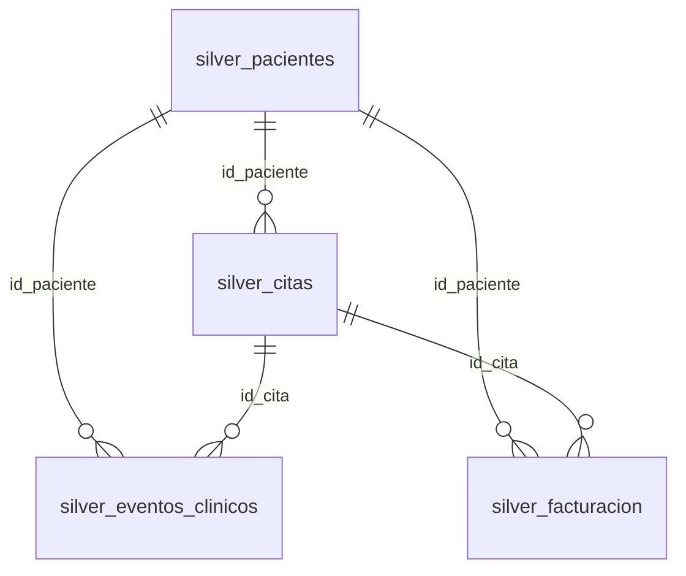

# Contratos de datos — IPS Analytics (Fase 1)

Define esquemas por capa medallión: **Bronze** (crudo + metadatos), **Silver** (tipado y reglas), **Gold** (modelo dimensional).  
Catálogo Unity Catalog: `ips_analytics`.

Referencias: [supuestos.md](./supuestos.md), [calidad_datos.md](./calidad_datos.md), [arquitectura.md](./arquitectura.md).

---

## 1. Convenciones globales

| Convención | Descripción |
|------------|-------------|
| **PK** | Clave natural de negocio (`id_*`); una fila activa por PK en Silver |
| **FK** | Referencias entre entidades; validadas en Silver |
| **Timestamps** | Almacenamiento `TIMESTAMP` (UTC del snapshot; sin conversión de zona en Fase 2–4) |
| **Decimales** | `DECIMAL(18,2)` para montos en Silver/Gold |
| **PII** | `numero_documento`, `nombres`, `apellidos` — enmascarados en Gold consumo BI |
| **Columnas técnicas Bronze** | Obligatorias en todas las tablas Bronze (ver §2) |
| **Columnas técnicas Silver** | `_silver_processed_at`, opcional `_is_valid`, flags de negocio documentados por tabla |

### 1.1 Columnas técnicas Bronze (todas las tablas)

| Columna | Tipo Bronze | Nullable | Descripción |
|---------|-------------|----------|-------------|
| `_ingested_at` | TIMESTAMP | No | Momento de ingesta al lakehouse |
| `_source_file` | STRING | No | Nombre archivo Excel (ej. `pacientes.xlsx`) |
| `_batch_id` | STRING | No | Identificador de corrida (UUID o `yyyyMMdd_HHmmss`) |
| `_row_hash` | STRING | Sí | SHA-256 de columnas fuente (detección de cambios, incremental futuro) |

---

## 2. Fuente: `pacientes.xlsx`

**Tabla Bronze:** `ips_analytics.bronze.pacientes`  
**Tabla Silver:** `ips_analytics.silver.pacientes`  
**Granularidad:** 1 fila = 1 paciente  
**PK:** `id_paciente`

### 2.1 Columnas de negocio

| Columna | Bronze | Silver | Gold (dim_paciente) | Reglas Silver |
|---------|--------|--------|---------------------|---------------|
| `id_paciente` | STRING | STRING NOT NULL | `id_paciente` (PK surrogate = mismo id) | Trim; no vacío |
| `tipo_documento` | STRING | STRING NOT NULL | `tipo_documento` | Dominio: CC, TI, CE, PAS, etc. (validar contra catálogo observado) |
| `numero_documento` | STRING | STRING NOT NULL | `numero_documento_hash` en vista BI; completo solo en Silver restringido | Cast desde numérico Excel a string sin notación científica |
| `nombres` | STRING | STRING NOT NULL | No expuesto en `dim_paciente_bi` | Trim |
| `apellidos` | STRING | STRING NOT NULL | No expuesto en `dim_paciente_bi` | Trim |
| `fecha_nacimiento` | STRING | DATE | `fecha_nacimiento` | Parseo defensivo; anomalías → `silver_rejects` (ej. tipo `time`) |
| `sexo` | STRING | STRING NOT NULL | `sexo` | Dominio: `F`, `M` |
| `aseguradora` | STRING | STRING NOT NULL | `aseguradora` | Trim |
| `ciudad` | STRING | STRING | `ciudad` | Null/vacío → `DESCONOCIDO` |
| `estado` | STRING | STRING NOT NULL | `estado_paciente` | Dominio: `Activo`, `Inactivo` |
| `creado_en` | STRING | TIMESTAMP NOT NULL | — | Parse timestamp |
| `actualizado_en` | STRING | TIMESTAMP NOT NULL | — | Parse timestamp; **cursor incremental** |

### 2.2 Derivados Silver (opcionales)

| Columna | Tipo | Descripción |
|---------|------|-------------|
| `edad_anios` | INT | `floor(datediff(current_date, fecha_nacimiento) / 365.25)` — solo si fecha válida |
| `_silver_processed_at` | TIMESTAMP | Fin de transformación Silver |

---

## 3. Fuente: `citas.xlsx`

**Tabla Bronze:** `ips_analytics.bronze.citas`  
**Tabla Silver:** `ips_analytics.silver.citas`  
**Granularidad:** 1 fila = 1 cita  
**PK:** `id_cita` | **FK:** `id_paciente` → pacientes

| Columna | Bronze | Silver | Gold (fact_citas) | Reglas Silver |
|---------|--------|--------|-------------------|---------------|
| `id_cita` | STRING | STRING NOT NULL | `id_cita` | PK única |
| `id_paciente` | STRING | STRING NOT NULL | `id_paciente` (FK dim) | Debe existir en `silver.pacientes` |
| `id_profesional` | STRING | STRING | `id_profesional` | Null/vacío → null; flag `sin_profesional_asignado` |
| `especialidad` | STRING | STRING NOT NULL | `especialidad` | Trim |
| `sede` | STRING | STRING | `sede` | Null/vacío → `DESCONOCIDO` |
| `fecha_hora_cita` | STRING | TIMESTAMP NOT NULL | `fecha_hora_cita` + `fecha_cita` (DATE derivada) | |
| `tipo_cita` | STRING | STRING NOT NULL | `tipo_cita` | Consulta, Valoración, Control, Procedimiento, Urgencia |
| `estado_cita` | STRING | STRING NOT NULL | `estado_cita` | Atendida, Programada, Cancelada, No asistió |
| `motivo_cancelacion` | STRING | STRING | `motivo_cancelacion` | Obligatorio lógico solo si `estado_cita = Cancelada` |
| `creado_en` | STRING | TIMESTAMP NOT NULL | — | |
| `actualizado_en` | STRING | TIMESTAMP NOT NULL | — | Cursor incremental |

### 3.1 Derivados Silver

| Columna | Tipo | Descripción |
|---------|------|-------------|
| `es_cita_cancelada` | BOOLEAN | `estado_cita = 'Cancelada'` |
| `es_no_asistencia` | BOOLEAN | `estado_cita = 'No asistió'` |
| `es_cita_atendida` | BOOLEAN | `estado_cita = 'Atendida'` |

---

## 4. Fuente: `eventos_clinicos.xlsx`

**Tabla Bronze:** `ips_analytics.bronze.eventos_clinicos`  
**Tabla Silver:** `ips_analytics.silver.eventos_clinicos`  
**Granularidad:** 1 fila = 1 evento clínico  
**PK:** `id_evento` | **FK:** `id_cita`, `id_paciente`

| Columna | Bronze | Silver | Gold (fact_eventos_clinicos) | Reglas Silver |
|---------|--------|--------|------------------------------|---------------|
| `id_evento` | STRING | STRING NOT NULL | `id_evento` | PK única |
| `id_cita` | STRING | STRING NOT NULL | `id_cita` | FK → `silver.citas` |
| `id_paciente` | STRING | STRING NOT NULL | `id_paciente` | FK → pacientes; debe coincidir con paciente de la cita |
| `tipo_evento` | STRING | STRING NOT NULL | `tipo_evento` | Signos vitales, Diagnóstico, etc. |
| `codigo_evento` | STRING | STRING NOT NULL | `codigo_evento` | |
| `descripcion_evento` | STRING | STRING NOT NULL | `descripcion_evento` | Trim |
| `fecha_hora_evento` | STRING | TIMESTAMP NOT NULL | `fecha_hora_evento` | |
| `valor_resultado` | STRING | DECIMAL(18,4) | `valor_resultado` | Null permitido |
| `unidad_resultado` | STRING | STRING | `unidad_resultado` | Null permitido |
| `estado_evento` | STRING | STRING NOT NULL | `estado_evento` | Finalizado, Pendiente, Cancelado |
| `creado_en` | STRING | TIMESTAMP NOT NULL | — | |
| `actualizado_en` | STRING | TIMESTAMP NOT NULL | — | Cursor incremental |

### 4.1 Derivados Silver

| Columna | Tipo | Descripción |
|---------|------|-------------|
| `tiene_resultado` | BOOLEAN | `valor_resultado IS NOT NULL` |
| `paciente_coherente_con_cita` | BOOLEAN | Validación join cita; false → reject |

---

## 5. Fuente: `facturacion.xlsx`

**Tabla Bronze:** `ips_analytics.bronze.facturacion`  
**Tabla Silver:** `ips_analytics.silver.facturacion`  
**Granularidad:** 1 fila = 1 línea de facturación  
**PK:** `id_factura` | **FK:** `id_paciente`, `id_cita`

| Columna | Bronze | Silver | Gold (fact_facturacion) | Reglas Silver |
|---------|--------|--------|-------------------------|---------------|
| `id_factura` | STRING | STRING NOT NULL | `id_factura` | PK única |
| `id_paciente` | STRING | STRING NOT NULL | `id_paciente` | FK pacientes |
| `id_cita` | STRING | STRING NOT NULL | `id_cita` | FK citas |
| `tipo_servicio` | STRING | STRING NOT NULL | `tipo_servicio` | |
| `pagador` | STRING | STRING | `pagador` | Null → `DESCONOCIDO` |
| `fecha_factura` | STRING | TIMESTAMP NOT NULL | `fecha_factura` + `fecha_factura_date` | |
| `valor_bruto` | STRING | DECIMAL(18,2) NOT NULL | `valor_bruto` | ≥ 0 |
| `valor_descuento` | STRING | DECIMAL(18,2) NOT NULL | `valor_descuento` | ≥ 0 |
| `valor_neto` | STRING | DECIMAL(18,2) NOT NULL | `valor_neto` | `round(bruto - descuento, 2) = neto` |
| `estado_pago` | STRING | STRING NOT NULL | `estado_pago` | Pagado, Pendiente, Pago parcial, Cancelado |
| `creado_en` | STRING | TIMESTAMP NOT NULL | — | |
| `actualizado_en` | STRING | TIMESTAMP NOT NULL | — | Cursor incremental |

### 5.1 Derivados Silver

| Columna | Tipo | Descripción |
|---------|------|-------------|
| `monto_cartera` | DECIMAL(18,2) | Neto si estado ∈ {Pendiente, Pago parcial}; else 0 |
| `es_factura_anulada` | BOOLEAN | `estado_pago = 'Cancelado'` |

---

## 6. Capa Gold — modelo dimensional

### 6.1 Dimensiones

#### `ips_analytics.gold.dim_paciente`

| Columna | Tipo | Origen |
|---------|------|--------|
| `sk_paciente` | BIGINT | Surrogate key (monotónica o hash) |
| `id_paciente` | STRING | Silver pacientes |
| `tipo_documento` | STRING | |
| `sexo` | STRING | |
| `aseguradora` | STRING | |
| `ciudad` | STRING | |
| `estado_paciente` | STRING | |
| `fecha_nacimiento` | DATE | |
| `edad_anios` | INT | |
| `_valid_from` | TIMESTAMP | SCD tipo 1 en MVP; SCD2 en evolución |

#### `ips_analytics.gold.dim_paciente_bi` (vista consumo Power BI)

Igual que `dim_paciente` **sin** PII directa; incluir `numero_documento_hash` (SHA-256 truncado) si se requiere identificador técnico.

#### `ips_analytics.gold.dim_tiempo`

| Columna | Tipo | Descripción |
|---------|------|-------------|
| `sk_fecha` | INT | `yyyyMMdd` |
| `fecha` | DATE | |
| `anio`, `mes`, `trimestre` | INT | |
| `nombre_mes` | STRING | |
| `es_fin_semana` | BOOLEAN | |

Generada por rango min/max de fechas en hechos o calendario 2025–2027.

#### `ips_analytics.gold.dim_especialidad` / `dim_sede` / `dim_tipo_servicio`

Vistas deduplicadas desde Silver (`SELECT DISTINCT ...`) con `sk_*` entero.

### 6.2 Hechos

#### `ips_analytics.gold.fact_citas`

Grain: **1 fila = 1 cita**  
Claves: `sk_fecha_cita`, `sk_paciente`, `sk_especialidad`, `sk_sede` + degenerate `id_cita`  
Medidas: conteo 1; flags `es_atendida`, `es_cancelada`, `es_no_asistencia` (0/1).

#### `ips_analytics.gold.fact_eventos_clinicos`

Grain: **1 fila = 1 evento**  
Claves: fecha evento, paciente, cita (degenerate), tipo evento  
Medidas: `valor_resultado` (nullable), `tiene_resultado` (0/1).

#### `ips_analytics.gold.fact_facturacion`

Grain: **1 fila = 1 línea factura**  
Claves: fecha factura, paciente, cita, tipo servicio, pagador  
Medidas: `valor_bruto`, `valor_descuento`, `valor_neto`, `monto_cartera`.

### 6.3 Vistas KPI (Gold)

| Vista | Grain | Uso |
|-------|-------|-----|
| `gold.v_kpi_operacion_citas` | día × especialidad × sede | BI página Operación |
| `gold.v_kpi_facturacion_mensual` | mes × pagador × tipo_servicio | BI página Finanzas |
| `gold.v_kpi_resumen_ips` | mes | Executive summary |

Definiciones de métricas en [kpis.md](./kpis.md).

---

## 7. Esquema operacional (`ips_analytics.ops`)

Diseño para ingesta incremental (implementación Fase 5).

### 7.1 `ops.ingestion_watermark`

| Columna | Tipo | Descripción |
|---------|------|-------------|
| `source_table` | STRING | PK lógica: `bronze.pacientes`, etc. |
| `watermark_column` | STRING | Default `actualizado_en` |
| `last_watermark` | TIMESTAMP | Último valor procesado exitosamente |
| `last_batch_id` | STRING | Última corrida OK |
| `updated_at` | TIMESTAMP | Auditoría |

### 7.2 `ops.pipeline_runs`

| Columna | Tipo | Descripción |
|---------|------|-------------|
| `run_id` | STRING | UUID |
| `batch_id` | STRING | |
| `stage` | STRING | bronze \| silver \| gold \| quality |
| `status` | STRING | success \| failed |
| `started_at` / `ended_at` | TIMESTAMP | |
| `rows_in` / `rows_out` / `rows_rejected` | BIGINT | |
| `error_message` | STRING | |

### 7.3 `ops.data_quality_results`

| Columna | Tipo | Descripción |
|---------|------|-------------|
| `check_id` | STRING | Referencia matriz calidad |
| `batch_id` | STRING | |
| `table_name` | STRING | |
| `passed` | BOOLEAN | |
| `metric_value` | DOUBLE | |
| `threshold` | DOUBLE | |
| `evaluated_at` | TIMESTAMP | |

---

## 8. Relaciones referenciales (Silver)

---

## 9. Evolución de esquema (schema drift)

| Política | Acción |
|----------|--------|
| Columna nueva en Excel | Bronze: `mergeSchema` true; Silver: actualizar contrato + deploy |
| Columna eliminada | Bronze conserva null; alerta en quality check |
| Cambio de tipo | Nueva versión contrato; reproceso Silver desde Bronze |

---

## 10. Implementación Bronze (Fase 2)

| Tema | Decisión implementada |
|------|------------------------|
| **Lectura** | `pandas.read_excel` (driver) → Spark; todas las columnas fuente como **STRING** |
| **Metadatos** | `_ingested_at` (UTC), `_source_file`, `_batch_id`, `_row_hash` (SHA-256 columnas negocio) |
| **Escritura** | `saveAsTable` Delta, modo **`overwrite`** por tabla (`load_mode=full`) |
| **Idempotencia** | Re-ejecutar la corrida reemplaza el snapshot; **un** `_batch_id` activo por tabla |
| **Cuarentena** | PK nula/vacía/`nan` → append `bronze.quarantine` con `_reject_reason`, `_entity` |
| **Código** | `src/ips_analytics/bronze/ingest_excel.py`, notebook `notebooks/01_bronze_ingesta.ipynb` |
| **DDL opcional** | `infra/ddl/02_bronze_tables.sql` (documentación + create vacío) |

Conteos esperados post-ingesta (baseline): pacientes 223, citas 1001, eventos 1602, facturacion 1202.

---

## 11. Trazabilidad documental

| Versión | Fecha | Cambio |
|---------|-------|--------|
| 1.0 | 2026-09-18 | Fase 1 — contratos iniciales |
| 1.1 | 2026-09-18 | Fase 2 — decisiones Bronze implementadas |
| 1.2 | 2026-09-18 | Fase 3 — pipeline Silver PySpark + `silver.rejects` |

---

## 12. Implementación Silver (Fase 3)

| Tema | Decisión |
|------|----------|
| Orden | pacientes → citas → eventos → facturacion |
| Escritura | `overwrite` tablas `silver.*`; rejects en `silver.rejects` |
| Rechazo pacientes | `fecha_nacimiento` no parseable, sexo ∉ {F,M} |
| Rechazo citas/eventos/facturación | FK huérfanas, reglas financieras |
| Derivados | flags citas, `tiene_resultado`, `monto_cartera`, `edad_anios` |
| Calidad | `04_data_quality.ipynb` + `quality/checks.py` |

---

## 13. Implementación Gold (Fase 4)

| Objeto | Descripción |
|--------|-------------|
| `dim_tiempo` | Calendario 2025–2027, `sk_fecha` = yyyyMMdd |
| `dim_paciente` | Sin nombres; incluye `numero_documento_hash` |
| `dim_especialidad`, `dim_sede`, `dim_tipo_servicio`, `dim_pagador`, `dim_tipo_evento` | Lookups con `sk_*` |
| `fact_citas`, `fact_eventos_clinicos`, `fact_facturacion` | Hechos con SKs + degenerates |
| `dim_paciente_bi` | Vista Power BI |
| `v_kpi_*` | Agregados operación / finanzas / resumen |
| Código | `src/ips_analytics/gold/build_star_schema.py`, `03_gold_model.ipynb` |

---

## 14. Calidad e incrementalidad (Fase 5)

| Tema | Implementación |
|------|----------------|
| Reporte QC | `quality/runner.py` → `ops.data_quality_results` |
| Orquestación | `pipeline/orchestrate.py`, `99_orchestration.ipynb` |
| Watermark | `ops/watermark.py`, tabla `ops.ingestion_watermark` |
| Modos | `load_mode=full` (overwrite) \| `incremental` (MERGE + filtro) |
| Doc defensa | [incrementalidad.md](./incrementalidad.md) |
